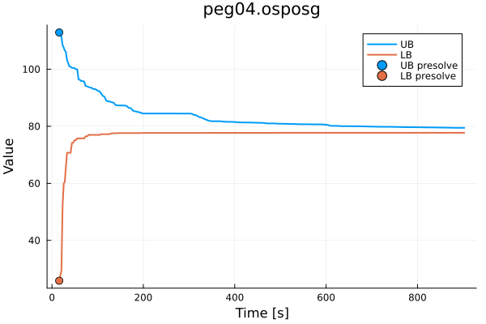

# HSVIforOSPOSGs

[](https://brozjak2.github.io/HSVIforOSPOSGs.jl/dev/)
[](https://github.com/brozjak2/HSVIforOSPOSGs.jl/actions/workflows/CI.yml?query=branch%3Amaster)
[](https://codecov.io/gh/brozjak2/HSVIforOSPOSGs.jl)

HSVIforOSPOSGs is **unofficial** Julia implementation of heuristic search value iteration (HSVI) algorithm for one-sided partially observable stochastic games (OSPOSGs) as described in [Heuristic Search Value Iteration for One-Sided Partially Observable Stochastic Games](https://doi.org/10.1016/j.artint.2022.103838).
OSPOSGs can be seen as a generalization of [Partially observable Markov decision processes](https://en.wikipedia.org/wiki/Partially_observable_Markov_decision_process) (POMDPs) and [Stochastic games](https://en.wikipedia.org/wiki/Stochastic_game), where one agent has imperfect information while their opponent has full knowledge of the current situation. The algorithm is multi-agent adaptation of [Heuristic Search Value Iteration for POMDPs](https://arxiv.org/abs/1207.4166).

## Game format

The games must be fed into the algorithm in compatible format, which is specified in [`games/game_format.txt`](games/game_format.txt).

Couple of [pursuit-evasion](https://en.wikipedia.org/wiki/Pursuit%E2%80%93evasion) games in this format are available in [`games/pursuit-evasion`](games/pursuit-evasion) directory.

## Getting started

To run the algorithm, load a game, configure the algorithm and call `solve` on them with desired precision gap and time limit.
The following example loads the smallest pursuit-evasion game, initializes the HSVI algorithm with default parameters and runs the algorithm until gap of 1.0 is achieved or for up to 5 minutes.
If the algorithm exceeds the time limit it is terminated.

```julia
using HSVIforOSPOSGs

osposg = OSPOSG("games/pursuit-evasion/peg03.osposg")
hsvi = HSVI()

recorder = solve(osposg, hsvi, 1.0, 300.0)
```

Note that the `recorder` contains records of the algorithm progress after each iteration and can be used for further examination or presentation of results.
The following plot was created by [`scripts/plot_example.jl`](scripts/plot_example.jl) and shows the convergence of bounds on [`games/pursuit-evasion/peg04.osposg`](games/pursuit-evasion/peg04.osposg):



Additional examples on how to configure and run the algorithm are provided in the [`scripts`](scripts) directory.

## LP Solvers

HSVIforOSPOSGs uses [GLPK](https://www.gnu.org/software/glpk) as a [JuMP](https://github.com/jump-dev/JuMP.jl) solver for linear programs by default because it is open-source and easily installable through standalone Julia package.
However, note that the LP models being solved in HSVI for OSPOSGs are quite complex and GLPK might get stuck on some of them or report them as being unfeasible (although they should be feasible).
Therefore, it is recommended to use more powerful solvers (such as [CPLEX](https://www.ibm.com/products/ilog-cplex-optimization-studio), [Gurobi](https://www.gurobi.com), etc.).
However, installing them is not as straightforward and often requires 3rd party binary and/or proprietary license.
If you wish to use different solver you can do so by installing the JuMP wrapper for the given solver (refer to installation instructions at [CPLEX.jl](https://github.com/jump-dev/CPLEX.jl), [Gurobi.jl](https://github.com/jump-dev/Gurobi.jl), etc.) and then pass the optimizer factory into `HSVI` constructor:

```julia
using CPLEX

HSVI(optimizer_factory=() -> CPLEX.Optimizer())
```

Fully working minimal example on how to do this can be seen in [`scripts/gurobi_example.jl`](scripts/gurobi_example.jl).

## Logging level

This package utilizes Julia logging facilities to communicate the progress of the algorithm to the user.
By default only info, warning and error messages are displayed.
To display more detailed debuging info, use the following before running the algorithm:

```julia
using Logging

global_logger(ConsoleLogger(stdout, Logging.Debug))
```

On the contrary, to disable info logging use:

```julia
global_logger(ConsoleLogger(stdout, Logging.Warn))
```

## Citing

If you find this work useful, we kindly request that you cite the following [paper](https://doi.org/10.1609/aaai.v31i1.10597), which introduces heuristic search value iteration for one-sided partially observable stochastic games:

```bibtex
@article{HorakBosanskyPechoucek2017,
  author  = {Horák, Karel and Bošanský, Branislav and Pěchouček, Michal},
  title   = {Heuristic Search Value Iteration for One-Sided Partially Observable Stochastic Games},
  journal = {Proceedings of the AAAI Conference on Artificial Intelligence},
  volume  = {31},
  number  = {1},
  year    = {2017},
  doi     = {https://doi.org/10.1609/aaai.v31i1.10597},
  url     = {https://ojs.aaai.org/index.php/AAAI/article/view/10597}
}
```

For an [extended version](https://doi.org/10.1016/j.artint.2022.103838) of the work containing all the proofs and technical implementation details cite:

```bibtex
@article{HorakBosanskyKovarikKiekintveld2023,
  author  = {Karel Horák and Branislav Bošanský and Vojtěch Kovařík and Christopher Kiekintveld},
  title   = {Solving zero-sum one-sided partially observable stochastic games},
  journal = {Artificial Intelligence},
  volume  = {316},
  pages   = {103838},
  year    = {2023},
  issn    = {0004-3702},
  doi     = {https://doi.org/10.1016/j.artint.2022.103838},
  url     = {https://www.sciencedirect.com/science/article/pii/S0004370222001783}
}
```

A preprint of this extended version is [freely available](https://arxiv.org/abs/2010.11243).

[Bachelor's thesis](https://dspace.cvut.cz/handle/10467/94666?locale-attribute=en) that introduced implementaion of the algorithm in Julia:

```bibtex
@thesis{Broz2021,
  author = {Brož, Jakub},
  title  = {Using Fast Upper-Bound Approximation in Heuristic Search Value Iteration},
  type   = {Bachelor's Thesis},
  school = {Czech Technical University in Prague},
  year   = {2021},
  url    = {https://dspace.cvut.cz/handle/10467/94666?locale-attribute=en}
}
```

---

This repository was created as part of semestral project in [Scientific Programming in Julia](https://juliateachingctu.github.io/Scientific-Programming-in-Julia) course at [CTU FEE](https://fel.cvut.cz/en).
